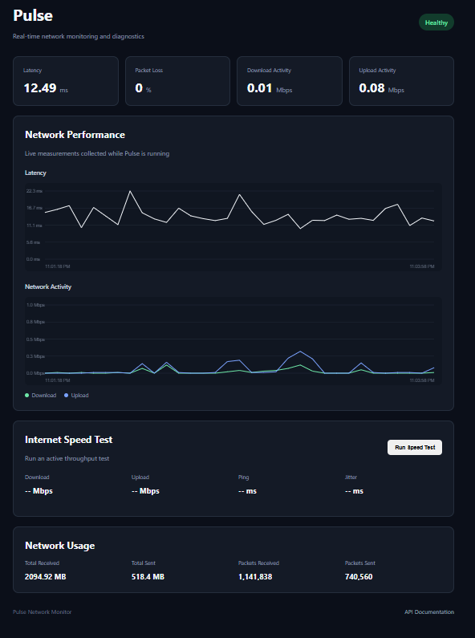

# Pulse

Pulse is a lightweight network monitoring and diagnostics application built with Python and FastAPI. It provides real-time information about network health, latency, packet loss, bandwidth usage and internet speed through both a REST API and a live browser-based dashboard.

The project was built as a compact exploration of backend API development, networking, asynchronous diagnostics and real-time data visualisation.



## Features

- **Network health monitoring** — classifies the current connection as healthy, degraded or offline.
- **Latency monitoring** — measures round-trip latency using ICMP ping requests.
- **Packet loss detection** — tracks successful and unsuccessful ping responses.
- **Live network activity** — measures current upload and download throughput.
- **Network usage statistics** — displays cumulative bytes and packets sent and received.
- **Internet speed testing** — performs an active download/upload speed test and reports ping and jitter.
- **Live performance charts** — visualises latency and network activity over time while the dashboard is running.
- **REST API** — exposes the network diagnostics through FastAPI endpoints.
- **Interactive API documentation** — automatically generated using FastAPI's Swagger UI.
- **Automated tests** — unit and API tests using pytest and FastAPI's TestClient.

## Dashboard

Pulse includes a lightweight dashboard built with HTML, CSS and vanilla JavaScript.

The dashboard polls the API for network measurements and displays:

- current network health;
- latency;
- packet loss;
- upload and download activity;
- historical latency;
- historical network activity;
- cumulative network usage; and
- manually triggered internet speed-test results.

Lightweight metrics are refreshed automatically, while the more bandwidth-intensive internet speed test is only performed when explicitly requested.

## Architecture

```text
                         ┌─────────────────────┐
                         │  Browser Dashboard  │
                         │   HTML / CSS / JS   │
                         └──────────┬──────────┘
                                    │
                                    │ HTTP
                                    ▼
                         ┌─────────────────────┐
                         │       FastAPI       │
                         │      REST API       │
                         └──────────┬──────────┘
                                    │
              ┌─────────────────────┼─────────────────────┐
              │                     │                     │
              ▼                     ▼                     ▼
       ┌─────────────┐      ┌──────────────┐      ┌──────────────┐
       │ Ping Service│      │  Bandwidth   │      │  Speed Test  │
       │             │      │   Service    │      │   Service    │
       └──────┬──────┘      └──────┬───────┘      └──────┬───────┘
              │                     │                     │
              ▼                     ▼                     ▼
           ping3                 psutil          internetspeedtest
```

The application separates API routing from the underlying network diagnostic services. This keeps individual measurements isolated and makes the networking logic easier to test independently.

## API

Pulse exposes the following endpoints:

| Endpoint | Description |
|---|---|
| `GET /` | Serves the Pulse dashboard |
| `GET /health` | Determines the overall health of the network connection |
| `GET /ping` | Measures latency and packet loss to a specified host |
| `GET /bandwidth` | Reports current network activity and cumulative network statistics |
| `GET /speed` | Runs an active internet download/upload speed test |
| `GET /metrics` | Returns combined lightweight health and bandwidth measurements |
| `GET /docs` | Opens the interactive Swagger API documentation |

### Ping

By default, Pulse measures connectivity against `8.8.8.8`.

A different host can be supplied using the query parameter:

```http
GET /ping?host=google.com
```

Example response:

```json
{
  "host": "google.com",
  "status": "reachable",
  "packets_sent": 4,
  "packets_received": 4,
  "packet_loss_percent": 0.0,
  "min_latency_ms": 14.21,
  "max_latency_ms": 19.42,
  "avg_latency_ms": 16.73
}
```

### Network Health

Pulse interprets the ping measurements to provide a simple network-health status.

A connection can be classified as:

- `healthy` — normal latency and packet loss;
- `degraded` — high latency or significant packet loss;
- `offline` — the target cannot be reached.

The health check is deliberately lightweight and does not execute an internet speed test.

### Bandwidth Monitoring

The bandwidth service uses operating-system network I/O counters to measure both cumulative usage and current transfer activity.

It reports metrics including:

```json
{
  "total_megabytes_sent": 517.32,
  "total_megabytes_received": 2093.66,
  "upload_rate_mbps": 0.02,
  "download_rate_mbps": 0.08,
  "packets_sent": 739158,
  "packets_received": 1140147
}
```

The upload and download rates represent traffic currently passing through the machine's network interfaces. They do **not** represent the maximum available internet connection speed.

### Internet Speed Test

The `/speed` endpoint performs an active throughput test against an external speed-test server.

It reports:

- download speed;
- upload speed;
- ping;
- jitter;
- selected test server; and
- bytes transferred during the test.

Unlike the other dashboard measurements, this test is only run when explicitly requested because it actively transfers a significant amount of data.

## Live Performance Monitoring

The dashboard samples the `/metrics` endpoint every five seconds.

These measurements are stored in memory by the browser and used to produce rolling charts for:

- latency; and
- upload/download activity.

The current implementation retains up to 120 samples, representing approximately ten minutes of network history.

Historical measurements are intentionally not persisted. Refreshing or closing the dashboard resets the graph history.

## Project Structure

```text
pulse/
├── app/
│   ├── __init__.py
│   ├── main.py
│   ├── services/
│   │   ├── __init__.py
│   │   ├── bandwidth.py
│   │   ├── health.py
│   │   ├── ping.py
│   │   └── speed.py
│   └── static/
│       ├── app.js
│       ├── index.html
│       └── style.css
├── assets/
│   └── dashboard.png
├── tests/
│   ├── __init__.py
│   ├── test_api.py
│   ├── test_health.py
│   └── test_ping.py
├── .gitignore
├── requirements.txt
├── requirements-dev.txt
└── README.md
```

## Technologies

### Backend

- Python
- FastAPI
- Uvicorn

### Networking

- `ping3` — ICMP latency and packet-loss measurement
- `psutil` — operating-system network I/O statistics
- `internetspeedtest` — active internet throughput testing

### Frontend

- HTML
- CSS
- Vanilla JavaScript
- HTML Canvas

### Testing

- pytest
- FastAPI TestClient

## Installation

Clone the repository:

```bash
git clone <repository-url>
cd pulse
```

Create a virtual environment:

```bash
python -m venv .venv
```

Activate it on Windows using Git Bash:

```bash
source .venv/Scripts/activate
```

Or using PowerShell:

```powershell
.venv\Scripts\Activate.ps1
```

Install the runtime dependencies:

```bash
python -m pip install -r requirements.txt
```

## Running Pulse

Start the FastAPI application with Uvicorn:

```bash
uvicorn app.main:app --reload
```

Then open:

```text
http://127.0.0.1:8000
```

to access the Pulse dashboard.

Interactive API documentation is available at:

```text
http://127.0.0.1:8000/docs
```

## Running the Tests

Install the development dependencies:

```bash
python -m pip install -r requirements-dev.txt
```

Run the test suite:

```bash
pytest -v
```

The test suite covers:

- successful ping measurements;
- unreachable hosts;
- partial packet loss;
- healthy network classification;
- degradation caused by latency;
- degradation caused by packet loss;
- offline network classification;
- dashboard availability; and
- Swagger documentation availability.

Network-dependent behaviour is mocked where appropriate so the unit tests do not depend on the machine's current internet connection.

## Design Decisions

### Separating network services

Ping, bandwidth monitoring, health classification and speed testing are implemented as separate services rather than placing all network logic directly inside the FastAPI routes.

This keeps the API layer small and makes individual components easier to understand, test and extend.

### Lightweight health checks

Internet speed testing is intentionally excluded from `/health` and `/metrics`. A speed test transfers a comparatively large amount of data and takes significantly longer than reading local network statistics or sending several ping requests.

This allows the dashboard to refresh lightweight metrics regularly without repeatedly performing expensive throughput tests.

### Client-side history

Performance history is currently maintained in the browser rather than persisted by the backend. This keeps Pulse lightweight and avoids introducing a database solely for dashboard visualisation.

For a longer-running monitoring system, the natural next step would be server-side metric collection and persistent time-series storage.